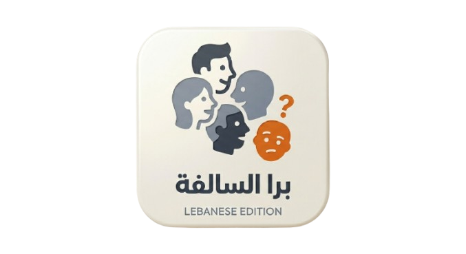
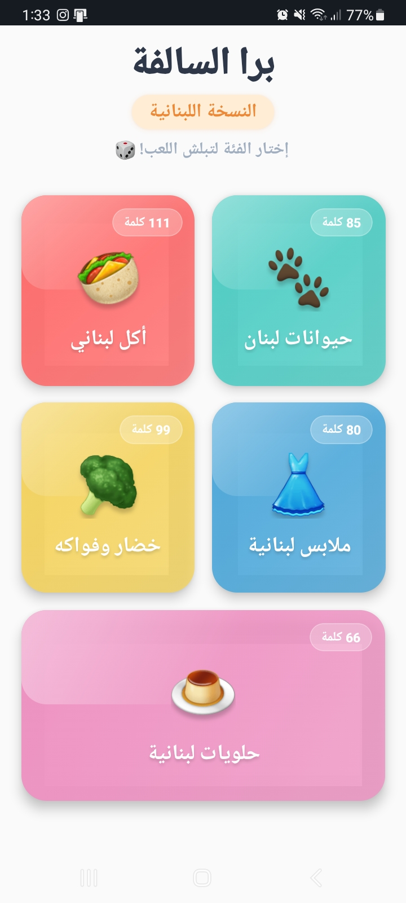
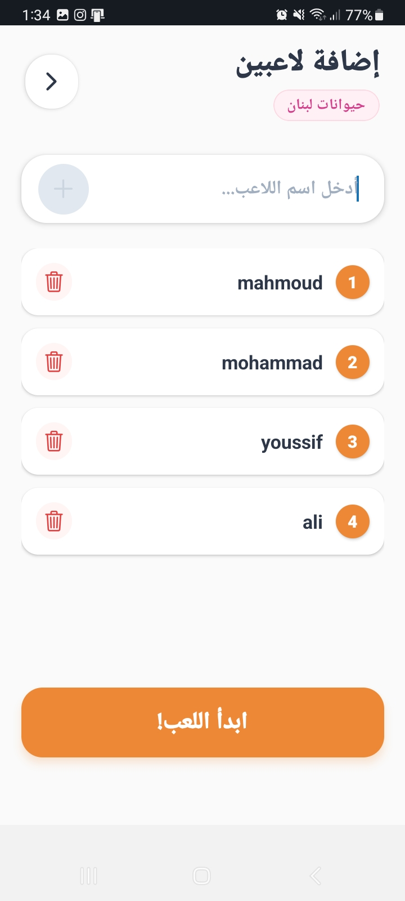
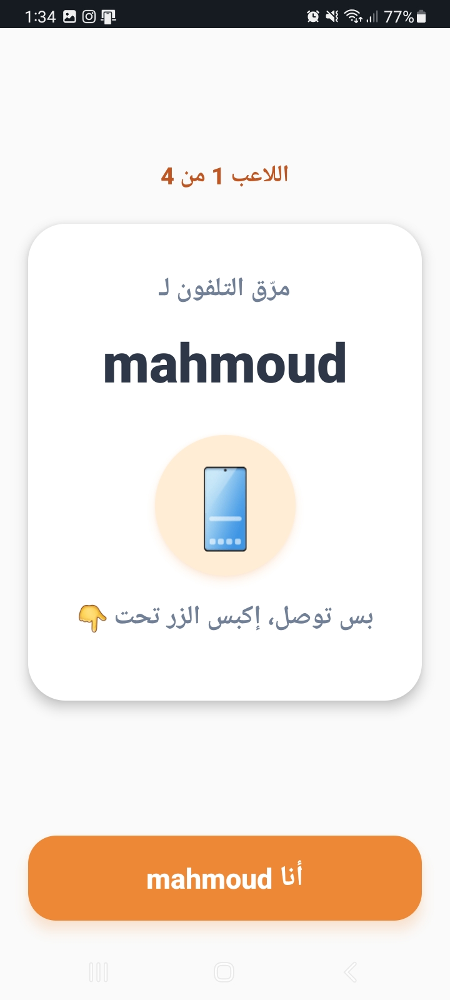
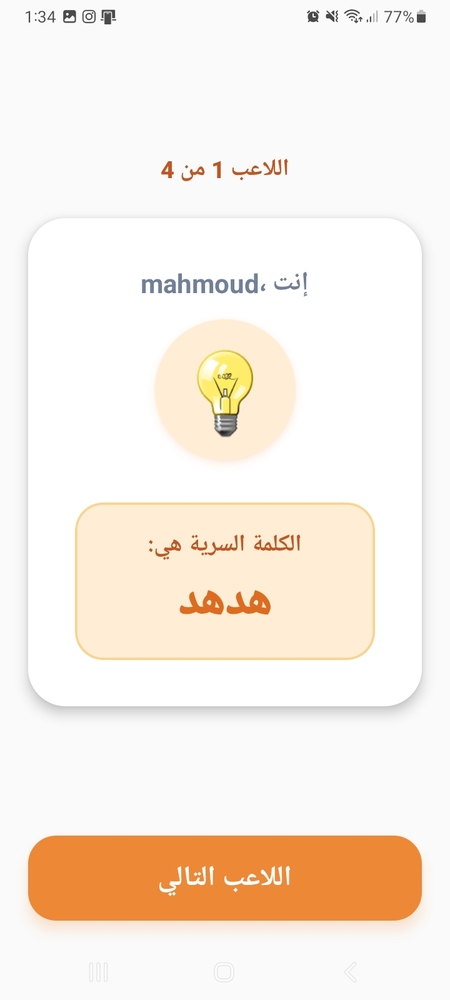
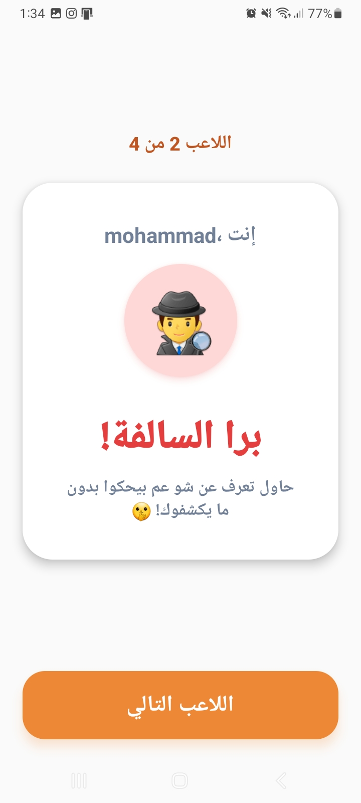
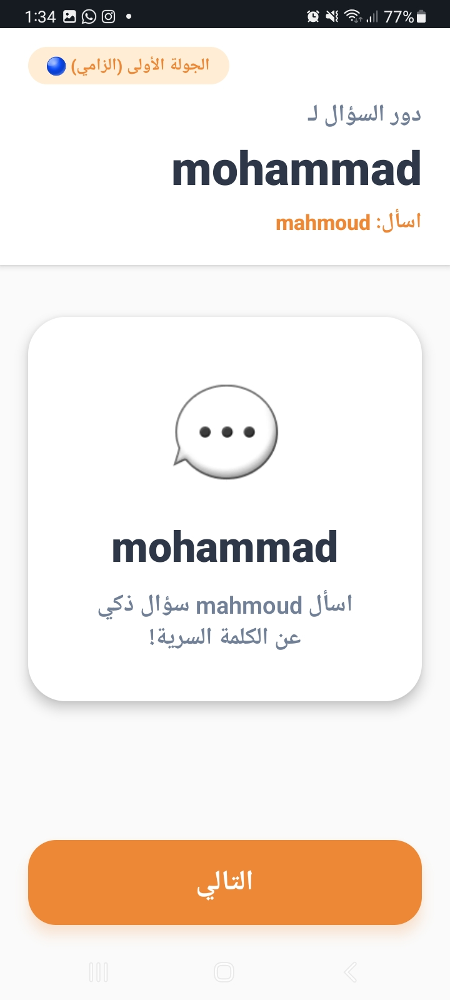
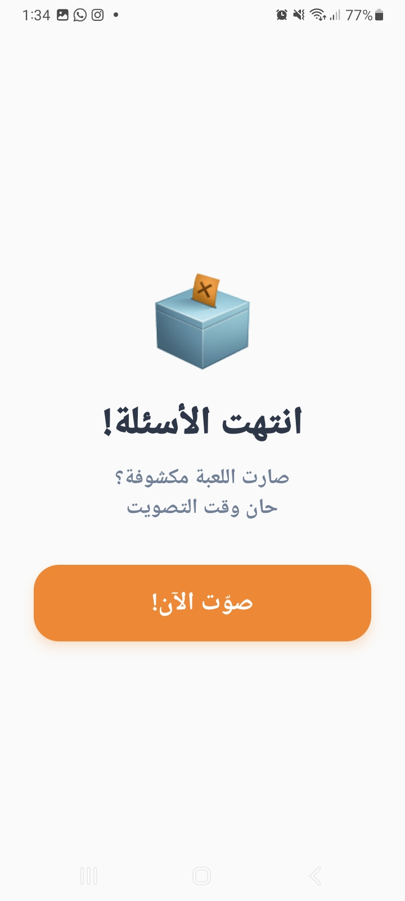
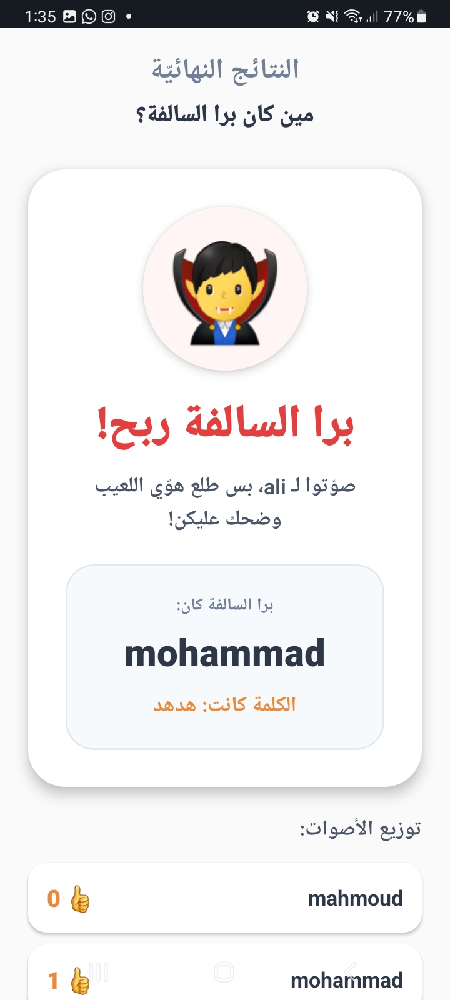

# 🎲 Bara Al-Selfe: Lebanese Edition

<p align="center">
  
</p>

### A social deduction party game for friends and families.

---

## 📸 Game Flow

| Start | Setup |
|-------|-------|
|  |  |

### Role Reveal
| Reveal 1 | Reveal 2 | Reveal 3 |
|----------|----------|----------|
|  |  |  |

### In-Game Interaction
| Questions | Voting | Results |
|-----------|--------|---------|
|  |  |  |

---

## 🚀 Features

- Fully localized for the Lebanese community
- Works completely offline
- Support for 3 to 10+ players
- Premium design with smooth animations
- Thousands of words across multiple categories

---

## 🛠️ Quick Start

### Prerequisites
- Node.js
- [Expo Go](https://expo.dev/go)

### Installation
```bash
git clone https://github.com/MahmoudAmouni/bara-al-selfe-LebaneseEdition.git
cd bara-al-selfe-LebaneseEdition/baraAlSelfe-LebansesEdition
npm install
npx expo start
```

## 🤝 Contributing

1. Fork the repository
2. Create your branch: `git checkout -b feature/new-category`
3. Commit your changes: `git commit -m 'Add new category: مهن'`
4. Push to the branch: `git push origin feature/new-category`
5. Open a Pull Request

---

## 👤 Credits

Developed with ❤️ by **Mahmoud Amouni**

---

